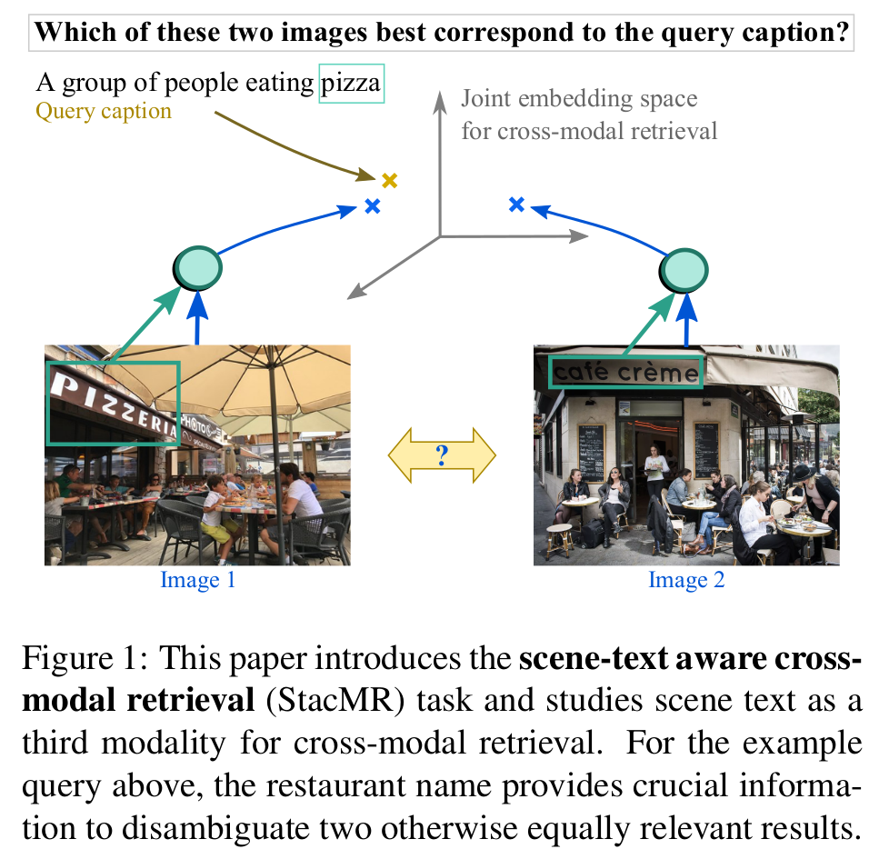
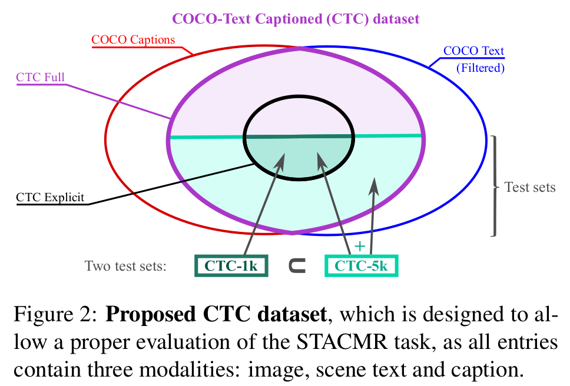
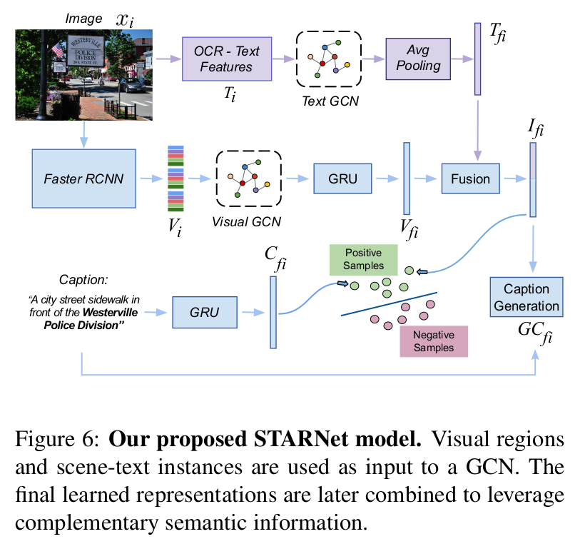

# StacMR (Scene Text Aware Cross Modal Retrieval)

Dataset and code based on our WACV 2021 Accepted Paper: https://arxiv.org/abs/2012.04329

Official Website is online! https://europe.naverlabs.com/research/computer-vision/stacmr-scene-text-aware-cross-modal-retrieval/

Project is built on top of the [VSRN] (https://github.com/KunpengLi1994/VSRN) in PyTorch.

## Introduction
Recent models for cross-modal retrieval have benefited from an increasingly rich understanding of visual scenes, afforded by scene graphs and object interactions to mention a few. This has resulted in an improved matching between the visual representation of an image and the textual representation of its caption. Yet, current visual representations overlook a key aspect: the text appearing in images, which may contain crucial information for retrieval. In this paper, we first propose a new dataset that allows exploration of cross-modal retrieval where images contain scene-text instances. Then, armed with this dataset, we describe several approaches which leverage scene text, including a better scene-text aware cross-modal retrieval method which uses specialized representations for text from the captions and text from the visual scene, and reconcile them in a common embedding space. Extensive experiments confirm that cross-modal retrieval approaches benefit from scene text and highlight interesting research questions worth exploring further. Dataset and code are available at https://europe.naverlabs.com/research/computer-vision/stacmr

Task:

<a href="url"></a>
<p></p>


## Install Environment 

Git clone the project.

Create Conda environment:

    $ conda env create -f environment.yml

Activate the environment:

    $ conda activate scan


## Coco-Text Captioned (CTC) Dataset:

<a href="url"></a>
<p></p>

To Download the CTC (Coco-Text Captioned) images, simply run:

    $ python CTC_img_downlader.py
 
The annotations are provided within this repo in a json format as CTC_anns.json

## Coco-Text Captioned (CTC) Dataset Precomputed Features:

The precomputed CTC features employed (visual and embedded OCR tokens) can be obtained from the following link:

https://drive.google.com/file/d/1C2ZOM2VB8PwjD-tdqdt00F3DW7m9YznQ/view?usp=sharing

The visual features were extracted by a Faster-RCNN trained on the Visual Genome dataset to predict objects and attributes.
The OCR features are embedded with fasttext.

Similar feature extraction method was employed to train the model and evaluate it with the TextCaps and Flickr30K Datasets.

## Trained Model Weights

<a href="url"></a>
<p></p>

Download Weights: 

https://drive.google.com/file/d/1araiEIbbLdiIzPWzGCWRIz4PEQuftgFb/view?usp=sharing

Paste the downloaded weights under the current repository directory in a folder named "runs".

## Train the Model

Extract the image features, OCR tokens with fasttext embedding of the Flickr30K and TextCaps Dataset. Construct a training dataset comprised of Flickr30K, TextCaps and CTC-validation set as described in the paper.

The combination of datasets (Flickr30K, TextCaps and CTC) used to train the model proposed in this paper can be downloaded from:

https://drive.google.com/file/d/1K66sBXZ9XcfDke7pg8DBmA8nBpnp-z9r/view?usp=sharing


Run the training script with the following options:

    $ python train.py --data_path $PATH_TO_YOUR_TRAINING_DATA$ --data_name f30k_precomp --logger_name runs/flickr_VSRN --max_violation --lr_update 10  --max_len 60


## Evaluation

To Evaluate the model on the CTC (Coco-Text Captioned) dataset, modify the evaluate_models.py file. Define the path were you extracted the CTC features and weights, and run the script:

    $ python evaluate_models.py

## Reference

If you found this research, dataset or code useful, please cite the following paper:

```
@inproceedings{mafla2020stacmr,
  title={StacMR: Scene-Text Aware Cross-Modal Retrieval},
  author={Mafla, Andr{\'e}s and Rezende, Rafael S and Gomez, Lluis and Larlus, Diane and Karatzas, Dimosthenis},
  booktitle={Proceedings of the IEEE/CVF Winter Conference on Applications of Computer Vision},
  pages={2220--2230},
  year={2020}
}
```


## License

[Apache License 2.0](http://www.apache.org/licenses/LICENSE-2.0)
